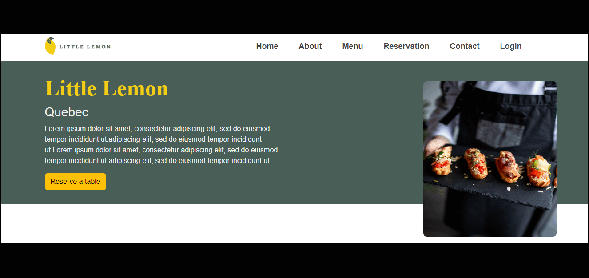
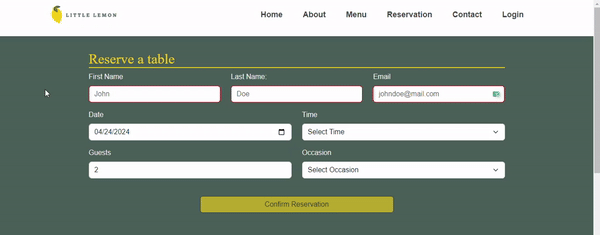

<h1 align="center">Little Lemon Restaurant</h1>

<h2 align="center">Meta Front-End Developer Capstone</h2>

<br />

  <h3 align="center"><a href="https://little-lemon-restaurant-masoud-maleki.vercel.app/"><strong>« Try demo »</strong></a></h3>


<br/>


<br/>

## Technologies

<p align="center">
    
    
    
    
    
    
    

</p>

## Pages

- Home
- About
- Menu
- Reservation
- Contact
- Login

  <br />

## Quick Start

```shell
$ git clone https://github.com/masoudm93/Little-Lemon-Restaurant.git
$ cd Little-Lemon-Restaurant
$ npm install
```

### Launch the app

Use the following command to run the app in your localhost.

```
npm start
```

## Contact

Feel free to contact me with the following links.

[](https://www.linkedin.com/in/masoud-maleki-891483218/)
[](https://masoudmaleki.com)
[](https://github.com/masoudm93)
